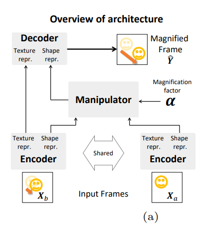
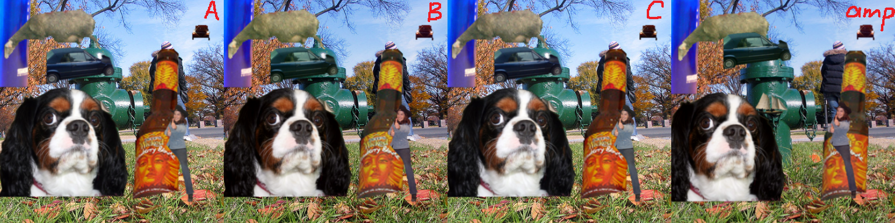

# Motion_magnification_learning-based
This is an unofficial implementation of "[Learning-based Video Motion Magnification](https://arxiv.org/abs/1804.02684)" in Pytorch (1.8.1~2.0).
[Here is the official implementation in Tensorflow==1.8.0](https://github.com/12dmodel/deep_motion_mag).

# Update
**(2023/11/05) Add notebook demo for offline inference. Feel free to email me or leave issues if you want any help I can do.**

**(2023/04/07) I find there are still a few friends like you who have interests in this old repo, so I make a Colab demo for easy inference if you want. And I'm sorry for my stupid codes years ago, I felt painful when I used them for the Colab demo... And you know, some still exist 😂 But if you have any trouble with it, feel free to leave an issue or send an e-mail to me.**

Besides, as tested, this repo can be run with **PyTorch 2.0**

*Given the video, and amplify it with only one click for all steps:*

# Env
`conda install pytorch==2.0.0 torchvision==0.15.1 pytorch-cuda=11.8 -c pytorch -c nvidia`

`pip install -r requirements.txt`

# Data preparation

0. About the synthetic dataset for **training**, please refer to the official repository mentioned above or download [here](https://drive.google.com/drive/folders/19K09QLouiV5N84wZiTPUMdoH9-UYqZrX?usp=sharing).

1. About the video datasets for **validation**, you can also download the preprocessed frames [here](https://drive.google.com/drive/folders/19K09QLouiV5N84wZiTPUMdoH9-UYqZrX?usp=sharing), which is named train_vid_frames.zip.

2. Check the settings of val_dir in **config.py** and modify it if necessary.

3. To convert the **validation** video into frames:

    `mkdir VIDEO_NAME && ffmpeg -i VIDEO_NAME.mp4 -f image2 VIDEO_NAME/%06d.png`

> Tips: ffmpeg can also be installed by conda.

4. Modify the frames into **frameA/frameB/frameC**:

    `python make_frameACB.py `(remember adapt the 'if' at the beginning of the program to select videos.)

# Little differences from the official codes

1. **Poisson noise** is not used here because I was a bit confused about that in official code. Although I coded it in data.py, and it works exactly the same as the official codes as I checked by examples.
2. About the **optimizer**, we kept it the same as that in the original paper -- Adam(lr=1e-4, betas=(0.9, 0.999)) with no weight decay, which is different from the official codes.
3. About the  in loss, we also adhere to the original paper -- set to 0.1, which is different from the official codes.
4. The **temporal filter** is currently a bit confusing for me, so I haven't made the part of testing with temporal filter, sorry for that:(...

# One thing **important**

If you check the Fig.2-a in the original paper, you will find that the predicted magnified frame  is actually X_b)*\alpha" title="texture(X_b)+motion(X_a->X_b)*\alpha" />, although the former one is theoretically same as X_b)*(\alpha+1)" />   with the same   .

However, what makes it matter is that the authors used perturbation for regularization, and the images in the dataset given has 4 parts:

1. frameA:   , unperturbed;
2. frameB: perturbed frameC, is actually     in the paper,
3. frameC: the real    , unperturbed;
4. **amplified**: represent both     and    , perturbed.

Here is the first training sample, where you can see clear that **no perturbation** between **A-C** nor between **B-amp**, and no motion between B-C:

Given that, we don't have the unperturbed amplified frame, so **we can only use the former formula**(with   ). Besides, if you check the **loss** in the original paper, you will find the   , where is the  ?... I also referred to some third-party reproductions on this problem which confused me a lot, but none of them solve it. And some just gave 0 to     manually, so I think they noticed this problem too but didn't manage to understand it.

Here are some links to the issues about this problem in the official repository, [issue-1](https://github.com/12dmodel/deep_motion_mag/issues/3), [issue-2](https://github.com/12dmodel/deep_motion_mag/issues/5), [issue-3](https://github.com/12dmodel/deep_motion_mag/issues/4), if you want to check them.

# Run
`bash run.sh` to train and test.

It took me around 20 hours to train for 12 epochs on a single TITAN-Xp.

If you don't want to use all the 100,000 groups to train, you can modify the `frames_train='coco100000'` in config.py to coco30000 or some other number.

You can **download the weights**-ep12 from [the release](https://github.com/ZhengPeng7/motion_magnification_learning-based/releases/tag/v1.0), and `python test_videos.py baby-guitar-yourself-...` to do the test.

# Results

Here are some results generated from the model trained on the whole synthetic dataset for **12** epochs. 

Baby, amplification factor = 50

Guitar, amplification factor = 20

And I also took a video on the face of myself with amplification factor 20, which showed a Chinese idiom called '夺眶而出'😂.

> Any question, all welcome:)
